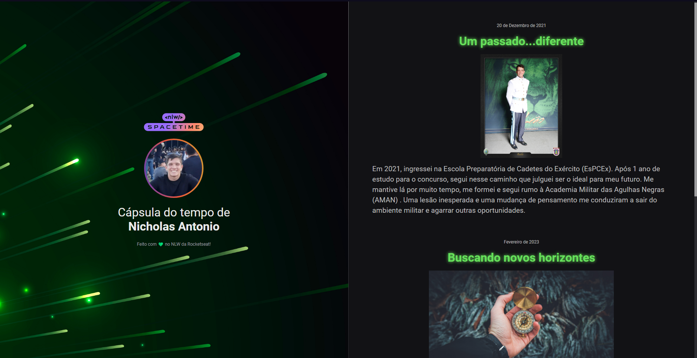

## 🖥️ Projeto

Esse é um projeto web responsivo de uma Cápsula do Tempo que exibe memórias em uma linha do tempo. 

## 👨‍💻 Tecnologias
Projeto realizado na NLW Spacetime da Rocketseat com as seguintes tecnologias:

- HTML
- CSS
- Git e Github

